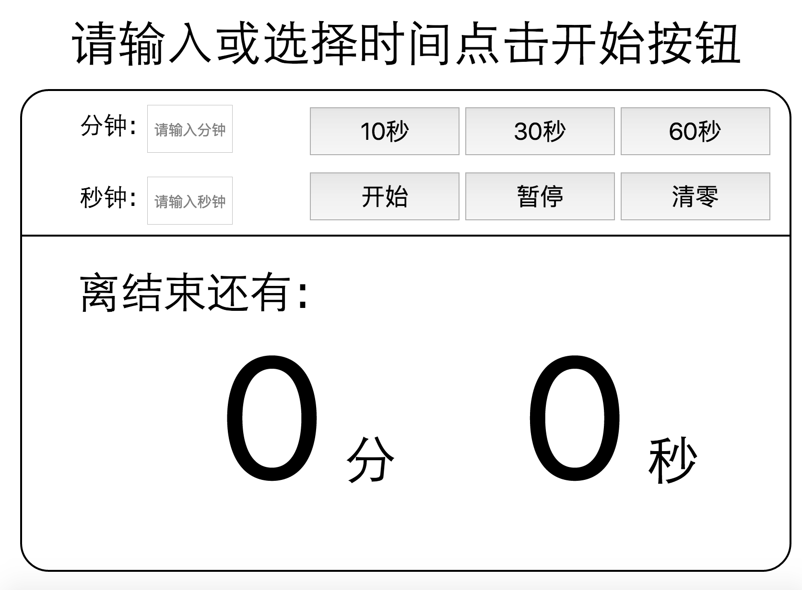

#简易的倒计时器
##功能
###输入
* 输入指定的分钟，秒钟进行。暂不支持小时。
* 目前只支持两位分钟输入。即最大99分59秒的输入。
* 可以输入大于60的秒钟可以自动转换成分钟。
* 考虑到用户体验，若只输入分钟或者秒钟也可以开始计时。未输入的默认为0

###开始
在输入时间之后点击开始开始倒计时.
###暂停
在开始之后点击暂停，暂停计时。
###继续
在暂停之后点击继续，继续计时。
###清零
点击清零，将计时时间清零。可重新输入

###小提示
在计时之后，必须点击清零或者计时结束才可以重新输入。
##更新
* **2015.11.18** 完成v1.0

